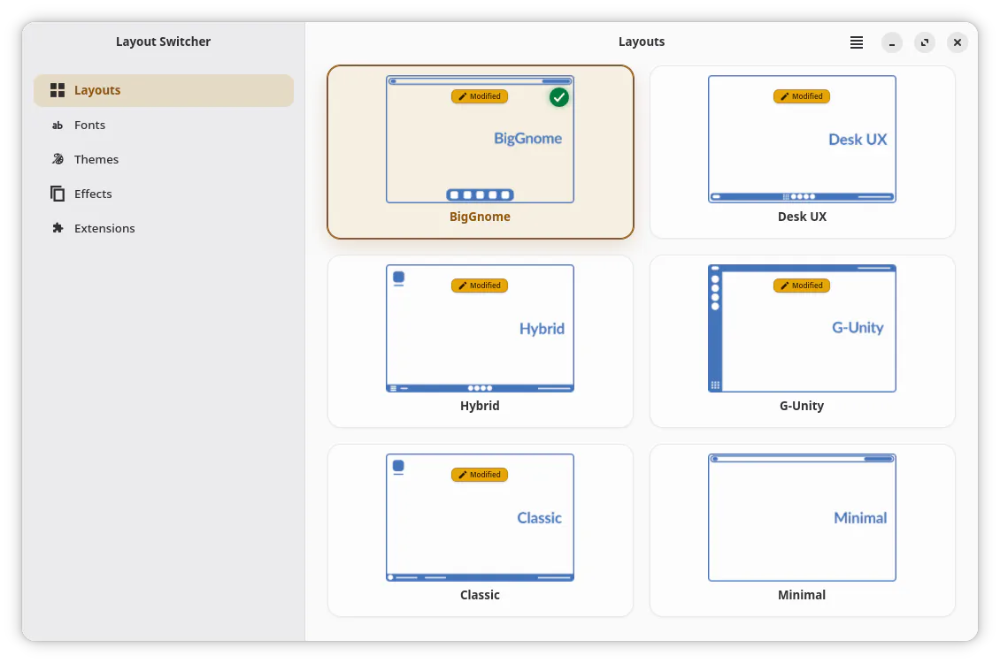
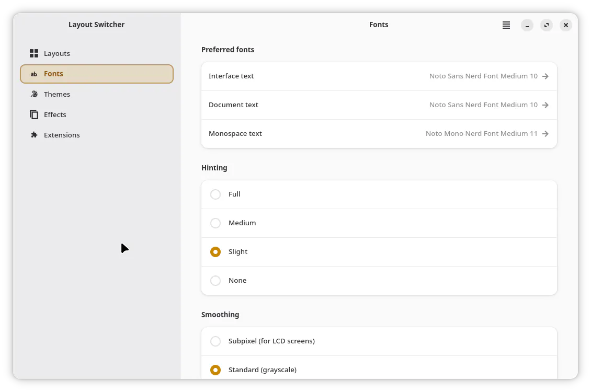
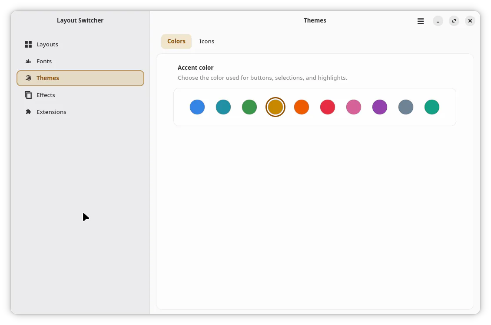
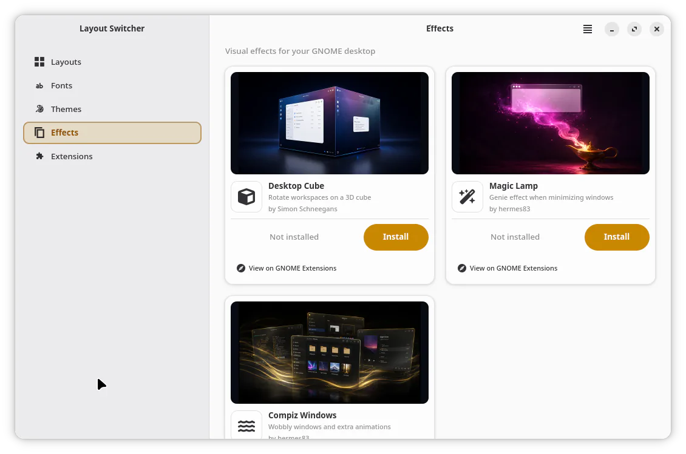
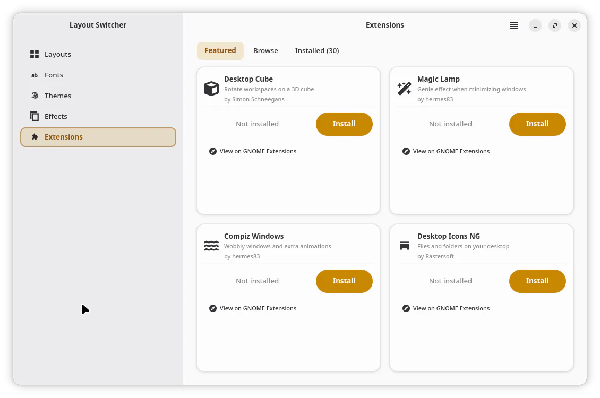

<h1 align="center">Big Gnome Center</h1>

<p align="center">
  A GTK4 and libadwaita appearance manager for GNOME.
</p>

<p align="center">
  Switch complete desktop layouts, tune fonts and themes, add visual effects,
  and manage GNOME Shell extensions from one application.
</p>

<p align="center">
  
  
  
  
  
  
  
</p>

Big Gnome Center is the appearance-management application developed
for [BigCommunity Linux](https://communitybig.org). It applies curated GNOME
desktop profiles and brings the related appearance and extension controls into
a single responsive interface.

## Features

- **Layouts** — Choose between BigGnome, Desk UX, Hybrid, G-Unity, Classic,
  and Minimal. Applying a layout creates a dconf backup automatically and can
  be undone from the success notification.
- **Per-layout snapshots** — Changes made after applying a layout are saved.
  When returning to it, choose between resuming the customized state and
  restoring the bundled original.
- **Live switching** — The bundled GNOME Shell helper coordinates extension
  transitions and stylesheet reloads inside the Shell. The selected profile is
  also written atomically to `~/.config/dconf/settings.gnome` for the next
  login.
- **Fonts** — Set interface, document, and monospace fonts; configure hinting,
  antialiasing, and text scale; search Google Fonts and install a family for
  the current user.
- **Themes** — Select one of ten GNOME accent colors and browse, preview,
  filter, and apply installed icon themes.
- **Desktop** — Control desktop icons, application-menu style, Super-key
  behavior, and notification placement independently from layout snapshots.
- **Panel and Dock** — Configure opacity, visibility, intelligent hiding, and
  running-application indicator styles for the bundled Community components.
- **Effects** — Install, enable, disable, configure, or remove Desktop Cube,
  Magic Lamp, and Compiz Windows from visual cards with previews.
- **Frosted Glass** — Apply overview blur on GNOME 50. GNOME 51 also supports
  independent blur for application windows, panels, docks, layout menus, and
  Quick Settings. Configure strength, material opacity, rendering mode,
  application exceptions, and maximized, fullscreen, or power-saving behavior.
- **Extensions** — Manage featured and installed extensions or search
  [extensions.gnome.org](https://extensions.gnome.org) without leaving the
  app. Search results support sorting, GNOME-version compatibility filtering,
  pagination, screenshots, ratings, recent comments, and direct installation.
- **Extension updates** — Check user-installed extensions individually or in
  bulk. A session monitor can notify about updates while the main window is
  closed; automatic updates remain opt-in.
- **Backups** — Create, restore, and delete full dconf snapshots from the main
  menu. The ten newest automatic or manual backups are retained by default.
- **Community Menu** — A bundled applications-menu extension used by the
  distribution layouts, independent from ArcMenu.
- **Localization** — Gettext catalogs are included for 29 languages.

## Screenshots

<p align="center">
  
  <br>
  <sub>Six curated layouts with active and modified-state indicators.</sub>
</p>

<table>
  <tr>
    <td align="center" width="50%">
      <br>
      <sub>Font families, rendering, scale, and Google Fonts.</sub>
    </td>
    <td align="center" width="50%">
      <br>
      <sub>GNOME accent colors and searchable icon themes.</sub>
    </td>
  </tr>
  <tr>
    <td align="center" width="50%">
      <br>
      <sub>Visual effects with previews and installation controls.</sub>
    </td>
    <td align="center" width="50%">
      <br>
      <sub>Featured, browsable, and installed extensions.</sub>
    </td>
  </tr>
</table>

## Requirements

- Linux with GNOME Shell 50–51. Overview blur requires GNOME Shell 50; the
  complete Frosted Glass surface backend requires GNOME Shell 51. The remaining
  Big Gnome Center features continue to support earlier listed versions.
- Python 3.10 or newer.
- PyGObject with GTK 4, libadwaita 1, and Pango bindings.
- `dconf`, `gsettings`, `gnome-extensions`, and
  `glib-compile-schemas`.
- The GNOME Shell extensions required by each layout. The Arch package declares
  the complete set in [`pkgbuild/PKGBUILD`](pkgbuild/PKGBUILD).
- Network access for extensions.gnome.org, extension updates, screenshots, and
  Google Fonts.

## Installation

Community Dock and Community Panel use their own extension UUIDs, so installing
this package does not remove or overwrite external Dash to Dock or Dash to
Panel installations. Applying a bundled layout disables those external
extensions and writes the shared dock/panel settings used by that layout; the
external packages remain installed and can be enabled again manually.

After upgrading from a release that used `@bigcommunity.org` extension UUIDs,
log out and back in once. The session guard migrates the helper, Community Menu,
and Big Shot UUIDs while preserving unrelated enabled and disabled extensions.

### BigCommunity or supported Arch repository

```sh
sudo pacman -S big-gnome-center
```

### Build the Arch package

Install `base-devel` and Git first, then run:

```sh
git clone https://github.com/big-comm/layout-switcher.git
cd layout-switcher/pkgbuild
makepkg -si
```

### Manual system install

This method copies the application files but does not install distro packages.
Install the requirements and layout extension dependencies first.

```sh
git clone https://github.com/big-comm/layout-switcher.git
cd layout-switcher
sudo cp -a usr/. /usr/
sudo cp -a etc/. /etc/
sudo glib-compile-schemas /usr/share/glib-2.0/schemas
```

Log out and back in after a manual install so the helper guard and bundled
GNOME Shell extensions are discovered for the new session.

## Usage

Open **Big Gnome Center** from the application grid or run:

```sh
big-gnome-center
```

The sidebar contains eight pages:

- **Layouts** — Apply or resume a desktop profile.
- **Fonts** — Change font families, rendering, scale, and Google Fonts.
- **Themes** — Change accent colors and icon themes.
- **Desktop** — Configure desktop icons, the application menu, and
  notification placement.
- **Panel and Dock** — Configure the active Community panel, taskbar, or dock.
- **Effects** — Configure Frosted Glass and manage the three featured
  visual-effect extensions.
- **Extensions** — Use the Featured, Browse, and Installed views.
- **Startup Applications** — Manage applications launched with the session.

The main menu provides **Check for updates**, **Auto-update extensions**,
**Backups…**, and **About**. Press <kbd>Ctrl</kbd>+<kbd>Q</kbd> to quit.

> [!IMPORTANT]
> Layout files are complete dconf profiles. Review the bundled profiles before
> adapting the application to another distribution. The app creates a backup
> before each switch, but dconf settings covered by the selected profile will
> change.

## User data

| Path | Purpose |
| --- | --- |
| `~/.config/big-gnome-center/settings.json` | Application preferences and active-layout state |
| `~/.config/big-gnome-center/backups/` | Full dconf backups |
| `~/.config/big-gnome-center/layout-snapshots/` | Customized state saved for each layout |
| `~/.config/dconf/settings.gnome` | Profile persisted for the next GNOME login |
| `~/.cache/big-gnome-center/` | Extension metadata, screenshots, and Google Fonts catalog cache |
| `~/.local/share/fonts/big-gnome-center/google-fonts/` | Google Fonts installed for the current user |

Set `BIG_GNOME_CENTER_N_KEEP` before starting the app to change the default
backup retention count of 10. The former `LAYOUT_SWITCHER_N_KEEP` name remains
accepted during migration.

## Development

Run directly from a checkout:

```sh
python3 usr/share/big-gnome-center/main.py
```

Install the development tools in your environment, then run the focused
project checks:

```sh
ruff check .
ruff format --check .
python3 -m pytest tests/ -q
```

The test suite is display-independent and currently contains 446 tests.

### Project structure

```text
etc/xdg/autostart/                 Session helper and update monitor startup
pkgbuild/                          Arch Linux package recipe and install hooks
tests/                             Service, layout, helper, extension, and asset tests
usr/bin/                           Application and helper-guard launchers
usr/share/applications/            Desktop entry
usr/share/gnome-shell/extensions/  Layout helper and bundled Community Shell components
usr/share/big-gnome-center/
├── main.py                        Adw.Application entry point
├── constants.py                   Application metadata and curated resources
├── layout_applier.py              Live layout-switch orchestration
├── backup_manager.py              Full dconf backup and restore
├── snapshot_manager.py            Per-layout customized snapshots
├── extension_manager.py           Extension lifecycle operations
├── ego_client.py                  extensions.gnome.org client
├── ego_cache.py                   Metadata and screenshot cache
├── update_checker.py              Extension update detection and apply
├── extension_update_monitor.py    Background checks and notifications
├── google_fonts.py                User-level Google Fonts installer
├── theme_manager.py               Accent, icon, and color-scheme integration
├── helper_client.py               D-Bus client for the Shell helper
├── layouts/                       Bundled complete dconf profiles
├── icons/                         Layout preview artwork
├── effects/                       Visual-effect preview images
└── ui/                            GTK4/libadwaita pages, dialogs, and widgets
usr/share/locale/                  PO sources and compiled MO catalogs
```

Frosted Glass architecture, GNOME 51 constraints, runtime validation, and
agent handoff notes are in [`docs/FROSTED_GLASS.md`](docs/FROSTED_GLASS.md).

### Layout file format

Layout files are absolute dconf dumps. Generate them in a configured GNOME
session with:

```sh
dconf dump / > usr/share/big-gnome-center/layouts/<layout-name>.txt
```

Do not generate them from `/org/gnome/shell/`: a layout can contain settings
outside that subtree and the loader expects absolute section paths.

## Translations

The application ships compiled `big-gnome-center` catalogs for:

> bg · cs · da · de · el · en · es · et · fi · fr · he · hr · hu · is · it
> · ja · ko · nl · no · pl · pt · pt_BR · ro · ru · sk · sv · tr · uk · zh

User-facing Python strings use `tr()`. The source template is
`usr/share/locale/big-gnome-center.pot`; locale sources are stored as
`usr/share/locale/<locale>.po` and compiled into the corresponding
`LC_MESSAGES` directory.

Example update workflow:

```sh
find usr/share/big-gnome-center -name '*.py' -print0 \
  | xargs -0 xgettext --keyword=tr --language=Python --from-code=UTF-8 \
      --output=usr/share/locale/big-gnome-center.pot \
      --package-name=big-gnome-center

msgmerge --update usr/share/locale/<locale>.po \
  usr/share/locale/big-gnome-center.pot

mkdir -p usr/share/locale/<locale>/LC_MESSAGES
msgfmt --check --output-file=usr/share/locale/<locale>/LC_MESSAGES/big-gnome-center.mo \
  usr/share/locale/<locale>.po
```

The bundled Community Menu maintains its own `community-menu` gettext domain.
The unified Shell runtime also owns local `dashtodock` and `dash-to-panel`
catalogs. All three domains cover the same 29 languages.

## License

Big Gnome Center is distributed under the [MIT License](LICENSE).
The bundled Community Menu is a modified GPL-2.0-or-later derivative; see its
[`COPYING`](usr/share/gnome-shell/extensions/community-menu@communitybig.org/COPYING)
and [`UPSTREAM.md`](usr/share/gnome-shell/extensions/community-menu@communitybig.org/UPSTREAM.md)
files. Additional asset licensing is documented under `usr/share/licenses/`.
